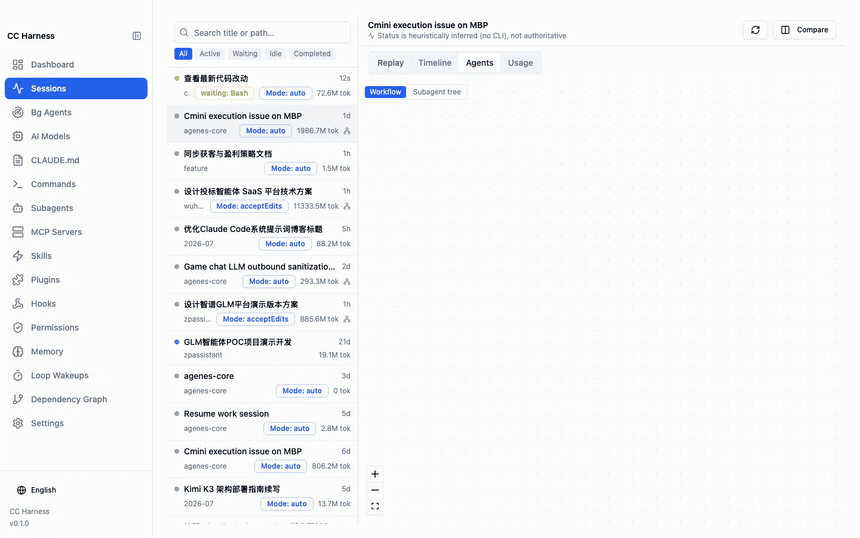
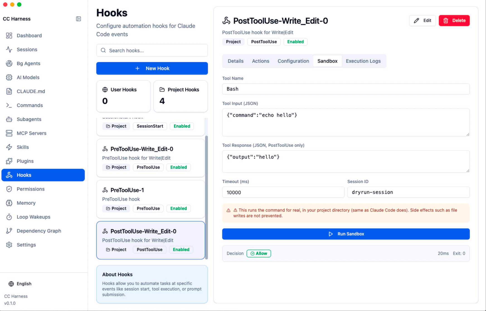
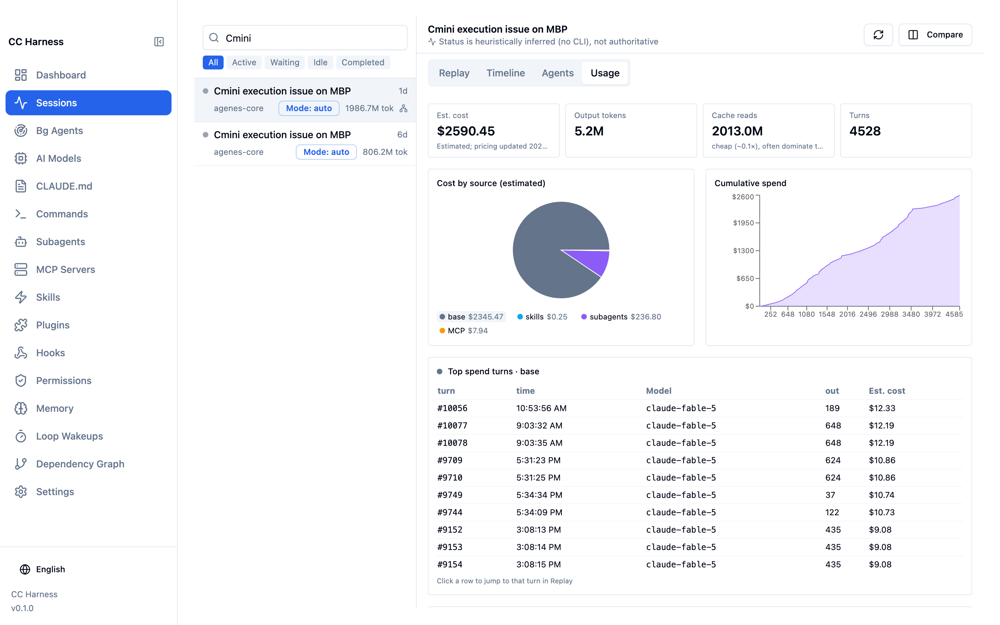
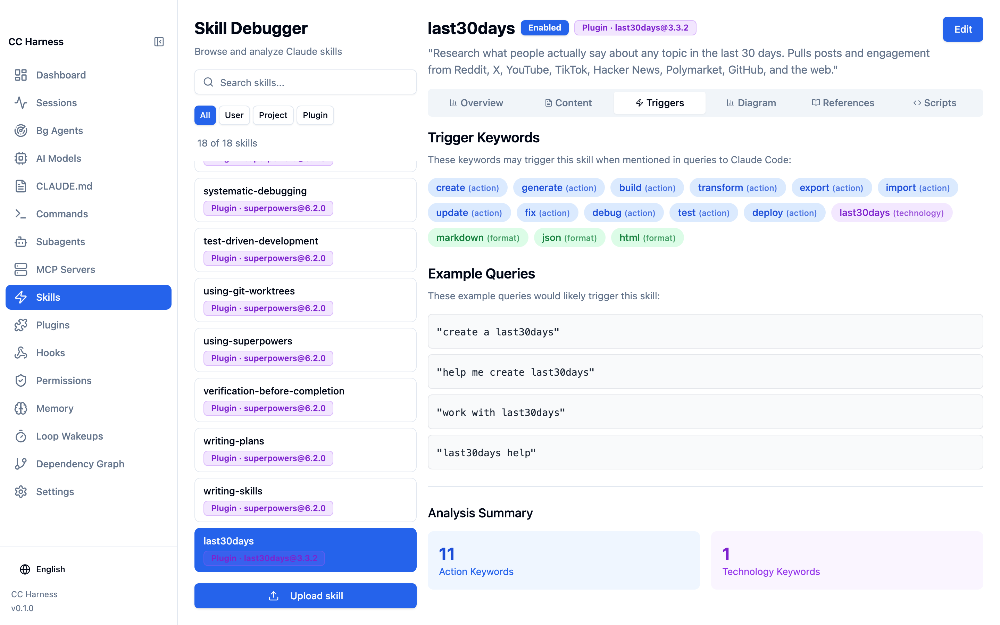

<div align="center">


# CC Harness

### See what Claude Code is actually doing

**An open-source desktop workbench for Claude Code: configure · debug · observe · orchestrate**

[简体中文](README.zh-CN.md) · [Report an issue](https://github.com/lookfree/cc-harness/issues)

<p>
  
  
  
  
</p>

</div>

Claude Code has grown from a single-session tool into a complex system: multi-session orchestration, background loops, scheduled wakeups, auto-memory. Every new capability adds another layer of opacity. The CLI shows you a counter — `Running agent 47/200`. **CC Harness shows you the topology.**



## What it does

- **Live subagent call tree** — tails session jsonl in real time and renders the 5-level subagent/workflow graph with per-node latency, token cost, and nesting depth. When a workflow stalls, you see which branch is stuck.

- **Hook sandbox** — dry-run any hook with simulated input: stdout, stderr, exit code, and the transformed result, without opening a real session. Fully isolated environment (`PATH` / `HOME` / `TMPDIR` only — no API tokens, no credentials).



- **Token cost breakdown** — per-session panel splitting skills / subagents / MCP / plugins / base session. Click a slice to rank that bucket's most expensive turns, then click a row to land on that exact message in the replay. Includes a real-time optimizer: repricing the current session's Opus tokens at Sonnet rates, so you see the exact dollar amount you'd save — from real data, not an estimate.



- **Loop & background task monitor** — aggregates `ScheduleWakeup` events across all sessions, classified as pending / fired / expired, with trigger history for each loop.

- **Skill trigger analyzer** — extracts trigger keywords from each skill (classified by action / technology / format / topic) and shows example prompts that would activate it. Plus a Mermaid structure diagram of every skill.



- **Dependency graph** — maps five relation types (Skills → MCP, Hooks → MCP, Skills ↔ Hooks, Commands → Skills, Commands → MCP) and assembles related nodes into numbered workflow chains:
  `① Hook fires → ② MCP server starts → ③ Skill activates → ④ MCP tool call`

- **Auto-memory diffs** — snapshots `MEMORY.md` before and after each dream pass, showing added / deleted / modified / merged / conflict-resolved changes. Memory consolidation, visible for the first time.

- **Config layer map** — Skills / Commands / Agents / Hooks from all three sources (user / project / plugin), with override relationships marked. Hand a project to a teammate without a word of explanation.

## What it's NOT

Not a chat client, not a CLI replacement. [claudia](https://github.com/getAsterisk/claudia) replaces the CLI's interaction surface; CC Harness does not touch the conversation at all. It reads your local `~/.claude/` state and makes it legible — judgment and actions stay with you.

## Quick start

```bash
git clone https://github.com/lookfree/cc-harness.git
cd cc-harness
npm install

# Desktop mode (primary, full features)
npm run electron:dev

# Web mode (browser, read-only)
npm run web:dev
```

**Prerequisites**: Node.js 18+, Claude Code CLI installed (`~/.claude/` exists).

**Privacy**: everything runs locally. CC Harness reads files under your own `~/.claude/` and uploads nothing.

## Status

| Phase | Scope | State |
|---|---|---|
| Phase 0 · Foundations | build ordering, scan fallbacks, path config, dependency checks | ✅ Done |
| Phase 1 · Configuration | skills (3-layer sources), plugin browser, commands, hooks type system, permission editor, layered config writes, model governance, worktree, agents, MCP | ✅ Done |
| Phase 2 · Observability | session jsonl parsing, session monitor, subagent topology, token usage, hook sandbox, loop panel, MCP health, memory panel | ✅ Done |
| Phase 3 · Compose & teach | business workflow templates, harness benchmark, onboarding tour | Planned |

Aligned with Claude Code **2.1.220** (model pricing incl. Opus 5 & fast tier, deprecated-model migration guidance, new sandbox/workflow settings, `DirectoryAdded` hook, subagent nesting semantics — all calibrated against the official changelog). Detailed specs in [`docs/harness-ide-spec/`](docs/harness-ide-spec/README.md).

## Tech stack

- **Desktop**: Electron + electron-builder
- **Backend (web mode)**: Express.js
- **Frontend**: React 18 + TypeScript + Vite
- **UI**: shadcn/ui + Tailwind CSS + Radix UI
- **Visualization**: React Flow (subagent topology)
- **Editor**: Monaco Editor
- **State**: Zustand · **i18n**: i18next (中文 / English)

## FAQ

**Does it modify my Claude Code config automatically?**
No. It shows you state, verifies hooks, analyzes cost — you decide and act.

**Does my session data leave my machine?**
No. It reads local files under `~/.claude/` and sends nothing anywhere.

**Desktop vs web mode?**
Desktop (Electron) is the primary mode with full features: live session monitoring, hook sandbox execution, MCP connection tests, file watching. Web mode is read-only browsing.

## License

[MIT](LICENSE)
